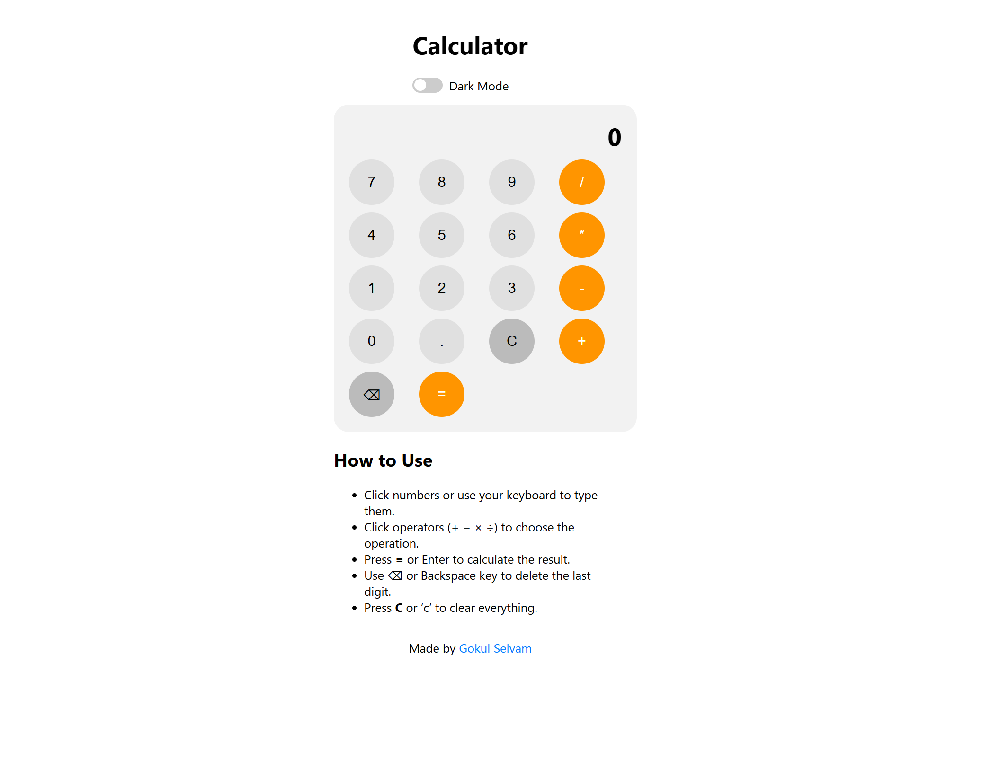

# Calculator Project

A simple on-screen calculator built using **HTML, CSS, and JavaScript** as part of The Odin Project: Foundations course. This project demonstrates the use of fundamental JavaScript concepts to create a fully functional calculator with a clean user interface.

Try the calculator online: [Calculator on Netlify](https://calculator-top-gokul.netlify.app/)

---

## Features

- Perform **basic arithmetic operations**: addition, subtraction, multiplication, division.
- Supports **decimal numbers**.
- **Clear (`C`) button** to reset calculations.
- **Backspace (`⌫`) button** to delete the last digit entered.
- **Keyboard support** for numbers, operators, decimal, Enter/`=` for calculation, Backspace, and `C`/`c` for clearing.
- **Dark mode toggle** to switch between light and dark themes.
- Handles **errors gracefully**, such as division by zero.
- Displays **current expression** above the result for easy tracking.

---

## How It Works

1. **Click Numbers / Operators:** Users can click on-screen buttons or use the keyboard to input numbers and operators.
2. **Operation Logic:** The calculator stores the first number, the operator, and the second number, then calculates the result when the equals (`=`) button is pressed.
3. **Expression Display:** Shows the current input and operator for clarity.
4. **Chained Calculations:** Uses the previous result as the first operand for subsequent operations.
5. **Error Handling:** Prevents invalid operations like consecutive operators or division by zero.

---

## Usage

1. Open `index.html` in your browser.
2. Use mouse clicks or your keyboard to input numbers and operators.
3. Press `=` or Enter to calculate.
4. Use `C` or `c` to clear.
5. Use `⌫` or Backspace to delete the last input.
6. Toggle **Dark Mode** with the switch at the top.

---

## File Structure

    calculator-project/
    │
    ├─ index.html # Main HTML structure
    ├─ styles.css # Styling for calculator and theme
    ├─ script.js # JavaScript logic for calculator operations
    └─ images/
        └─ calculator_img.png # Project preview image

---

## Technologies Used

- **HTML5** – Structure of the calculator.
- **CSS3** – Styling, grid layout, and dark/light theme toggle.
- **JavaScript (ES6+)** – Handles calculator logic, user input, and DOM manipulation.

---

## Lessons Learned

- Implementing calculator logic without using `eval()` or `new Function()` to ensure safe evaluation.
- Handling **user input edge cases** (consecutive operators, decimals, empty inputs).
- Dynamically updating the display and expression.
- Implementing **keyboard support** for enhanced UX.
- Toggling themes using CSS variables and JavaScript.

---

## Author

Made by [Gokul Selvam](https://github.com/gokulselvam2911)

---

## Acknowledgments

- [The Odin Project](https://www.theodinproject.com) – Foundations course.
